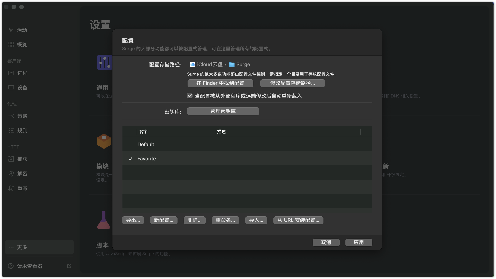
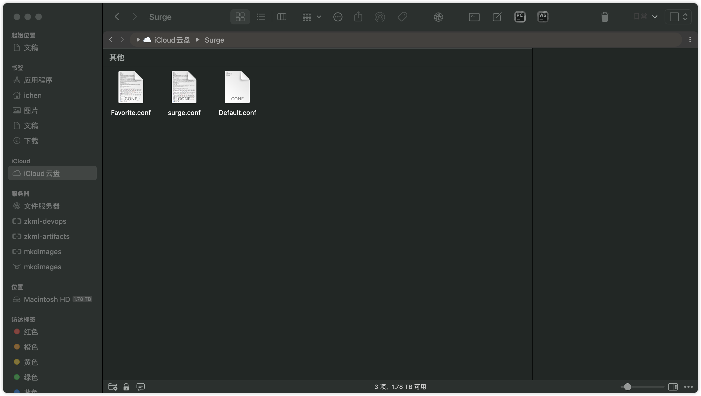
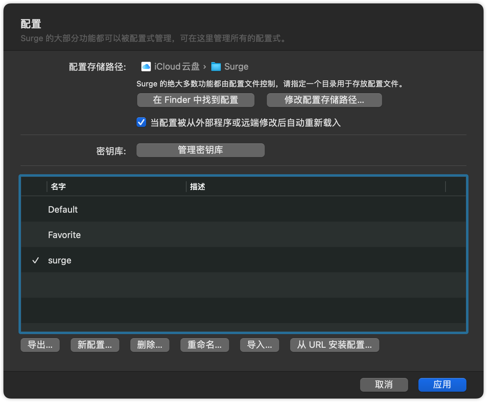
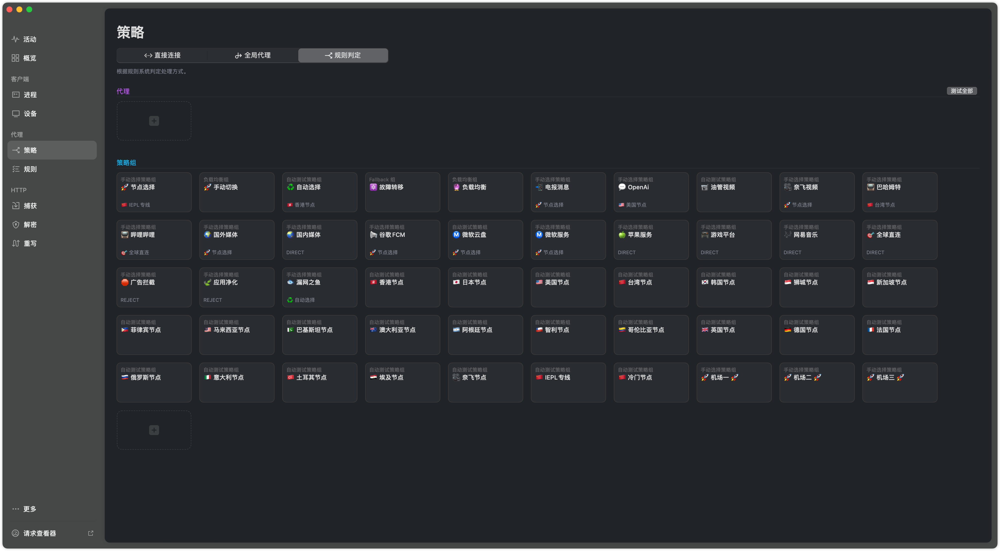
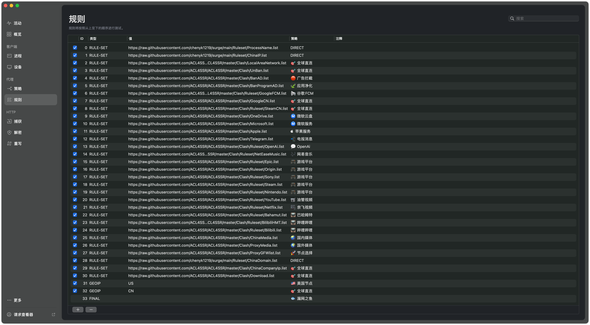
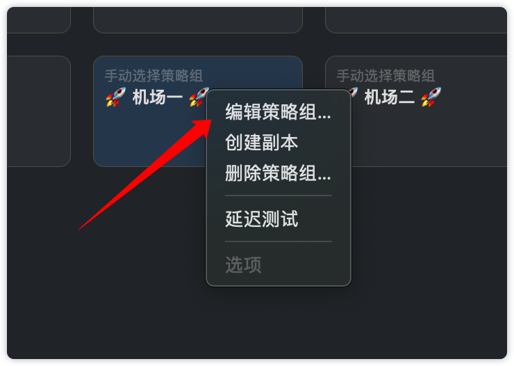
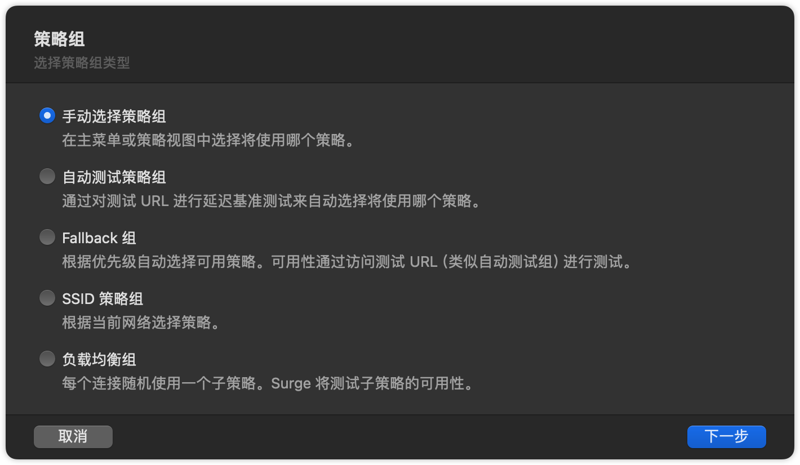
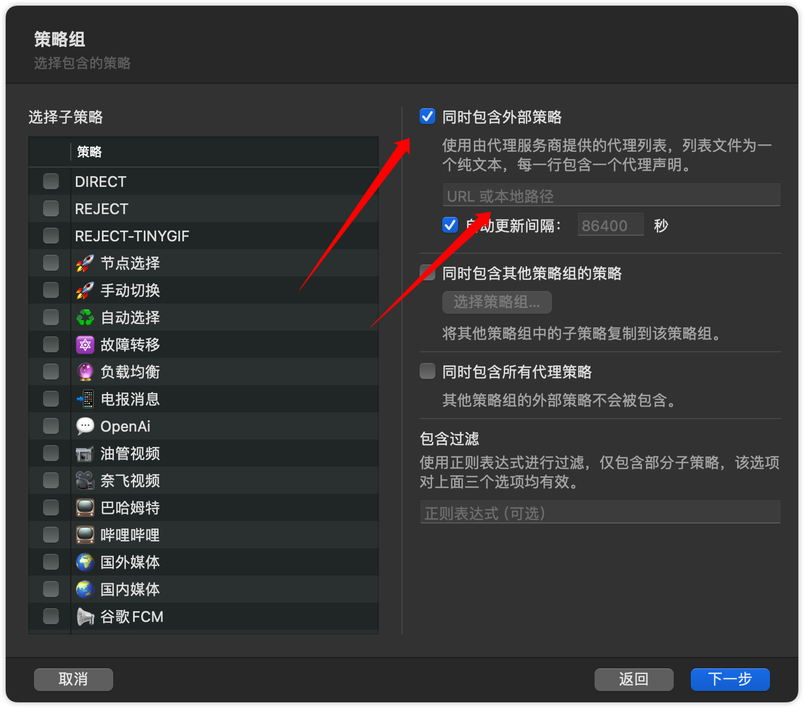
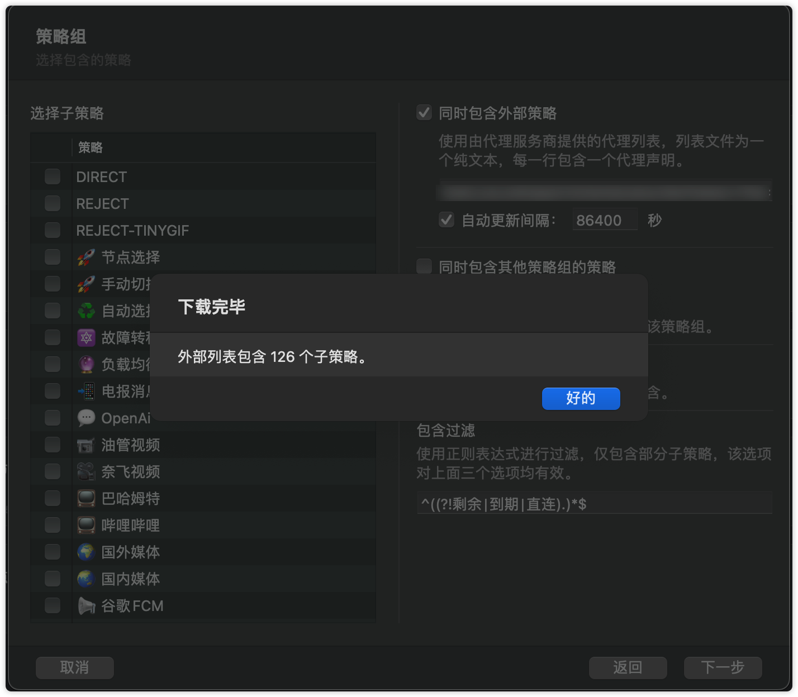
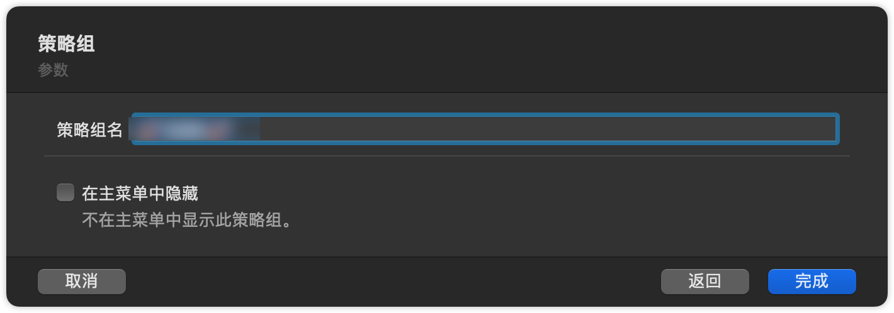

# Surge
> 自用配置集合
> 为了避免订阅暴露的风险，本仓库不涉及订阅的转换
> 修改国内的域名和IP(每天定时自动更新release分支)
> ```shell
> https://raw.githubusercontent.com/chenyk1219/surge/release/ChinaDomain.list
> 
> https://raw.githubusercontent.com/chenyk1219/surge/release/ChinaIP.list
>```

### 1. 安装

下载本仓库

```shell
git clone https://github.com/chenyk1219/surge.git
```

打开surge配置文件夹

在`更多`--->`配置`--->`在Finder中找到配置`



将`surge.conf`拖放到文件夹里



在配置里双击`surge.conf`并应用



打开策略和规则，你就可以看到已经添加好的策略和规则





### 2. 配置代理

在策略里右击，选则`编辑策略组`



直接下一步



选则`同时包含外部策略`，将🪜的配置的URL（链接要带token：https://xxxxx/subscribe?token=xxxxxx） 粘贴到这里，下一步





然后取个名字就完成了



有多少个🪜就配置多少个

### 3. 鸣谢

本仓库引用的 CN IP 是[@Hackl0us](https://github.com/Hackl0us/GeoIP2-CN) 维护的GEOIP-CN

本仓库引用的 CN DOMAIN 是[@felixonmars](https://github.com/felixonmars/dnsmasq-china-list) 维护的dnsmasq-china-list

